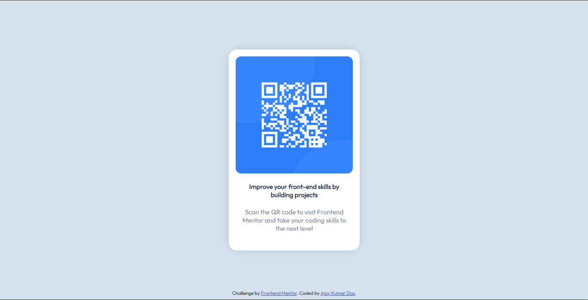

# Frontend Mentor - QR code component solution

This is a solution to the [QR code component challenge on Frontend Mentor](https://www.frontendmentor.io/challenges/qr-code-component-iux_sIO_H).

## Table of contents

- [Frontend Mentor - QR code component solution](#frontend-mentor---qr-code-component-solution)
  - [Table of contents](#table-of-contents)
  - [Overview](#overview)
    - [Screenshot](#screenshot)
    - [Links](#links)
  - [My process](#my-process)
    - [Built with](#built-with)
    - [What I learned](#what-i-learned)
    - [Useful resources](#useful-resources)
  - [Author](#author)

## Overview

### Screenshot

### Links

- Solution URL: [https://github.com/ajoykumardas12/QR-code-component]
- Live Site URL: [https://ajoykumardas12.github.io/qr-code-component/]

## My process

### Built with

- Semantic HTML5 markup
- CSS
- CSS custom properties
- Flexbox
- Mobile-first workflow

### What I learned

Improving skills through challenges is fun. Completing this challenge I practiced using CSS variables and Flexbox.

### Useful resources

- [CSS Flexbox](https://www.w3schools.com/css/css3_flexbox.asp) - This helped me with layout and positioning using CSS flexbox.
- [CSS Box Shadow](https://developer.mozilla.org/en-US/docs/Web/CSS/box-shadow) - This helped me learn about CSS box-shadow.

## Author

- Website - [Ajoy Kumar Das](https://ajoykumardas.vercel.app/)
- Frontend Mentor - [ajoykumardas12](https://www.frontendmentor.io/profile/ajoykumardas12)
- Twitter - [AjoykrDas_](https://twitter.com/AjoykrDas_)